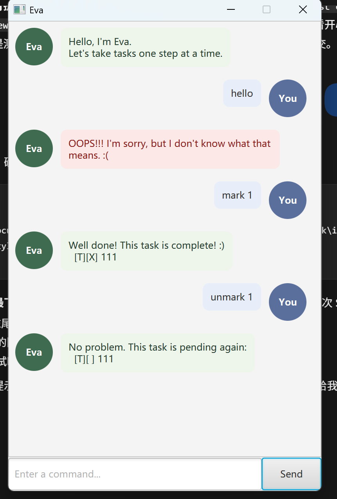

# Eva User Guide

<table>
  <tr>
    <td width="50%" valign="top">
      <p>Eva is a desktop task manager for todos, deadlines, and events.</p>
      <p>Type a command in the box at the bottom of the window, then press <strong>Enter</strong> or click <strong>Send</strong>.</p>
      <p>Eva saves your tasks automatically and loads them again when it starts.</p>
    </td>
    <td width="50%" align="center" valign="top">
      <a href="Ui.png"></a>
    </td>
  </tr>
</table>

## Commands

| Action | Command | Example |
| --- | --- | --- |
| Add a todo | `todo DESCRIPTION` | `todo read a book` |
| Add a deadline | `deadline DESCRIPTION /by YYYY-MM-DD` | `deadline submit report /by 2026-09-30` |
| Add an event | `event DESCRIPTION /from START /to END` | `event team meeting /from 09:00 /to 10:00` |
| Show all tasks | `list` | `list` |
| Mark a task as done | `mark NUMBER` | `mark 1` |
| Mark a task as not done | `unmark NUMBER` | `unmark 1` |
| Delete a task | `delete NUMBER` | `delete 1` |
| Find tasks by description | `find KEYWORD` | `find report` |
| Sort deadlines by date | `sort` | `sort` |
| Ask AI about Eva's features | `@ai QUESTION` | `@ai how do I add a deadline?` |
| Exit Eva | `bye` | `bye` |

Use the task numbers shown by `list` when marking, unmarking, or deleting tasks. Deadline dates must use `YYYY-MM-DD`. `sort` puts deadlines first, from earliest to latest; other tasks follow. `find` ignores letter case and numbers its results separately from the full list.

Eva automatically saves changes in `data/eva.txt`, relative to the folder from which you run the app, and loads them when it starts. Invalid commands produce a red error message. If the saved data file is damaged, Eva will not overwrite it; fix the file before changing tasks.

## Optional AI help

The `@ai` command asks a remote AI service questions about Eva's features. It is read-only and never changes your tasks. Ordinary commands continue to work without an API key.

To enable it, create a free Groq API key at [console.groq.com](https://console.groq.com), store the key in the `LLM_API_KEY` environment variable, and then start Eva from the same terminal. Do not put the key in source code or commit it to Git.

In Windows Command Prompt:

```text
set LLM_API_KEY=your_api_key_here
java -jar eva.jar
```

In PowerShell:

```text
$env:LLM_API_KEY="your_api_key_here"
java -jar eva.jar
```

Example: `@ai is there a command to add priorities to tasks?`

If the key is missing, invalid, or the service cannot be reached, Eva shows an error while the rest of the app remains usable. AI answers can be inaccurate, so use the command descriptions in this guide as the authoritative reference.

## Running Eva

Install Java 25 and download the JAR file from the latest [GitHub release](https://github.com/legned-wenze/ip/releases). Open a terminal in the folder containing the JAR and run it with `java -jar`. For example, if the downloaded file is named `eva.jar`:

```text
java -jar eva.jar
```
